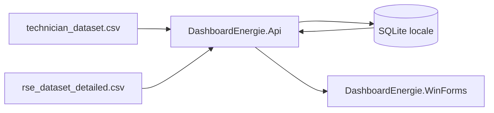

# Architecture simplifiee

## Vue d'ensemble

## Projets

- `DashboardEnergie.Api`
  - importe les CSV dans SQLite
  - calcule les aggregations minute, heure et jour
  - expose les endpoints `snapshot`, `summary`, `latest`, `alerts`, `aggregations`, `rse-monthly`, `reload`, `health`
- `DashboardEnergie.Shared`
  - centralise les DTO echanges entre l'API et WinForms
- `DashboardEnergie.WinForms`
  - shell dashboard avec top bar + navigation laterale
  - fournit 4 vues utilisateur : vue d'ensemble, technicien, RSE/objectifs, previsions
  - consomme l'API locale via HTTP

## Flux de demarrage

1. WinForms demarre.
2. Si necessaire, WinForms demarre l'API locale.
3. SQLite est creee localement.
4. Les fichiers CSV du dossier `Data/` sont importes.
5. WinForms verifie `api/dashboard/health`, puis appelle `api/dashboard/snapshot`.
6. Les donnees sont affichees dans les vues metier et les KPI.
