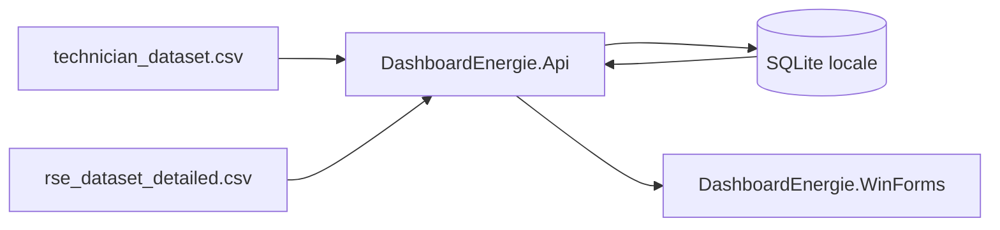

# Architecture simplifiee

## Vue d'ensemble

## Projets

- `DashboardEnergie.Api`
  - importe les CSV dans SQLite
  - calcule les aggregations minute, heure et jour
  - expose les endpoints `snapshot`, `summary`, `latest`, `alerts`, `aggregations`, `rse-monthly`, `reload`
- `DashboardEnergie.Shared`
  - centralise les DTO echanges entre l'API et WinForms
- `DashboardEnergie.WinForms`
  - fournit deux vues utilisateur : technicien et responsable RSE
  - consomme l'API locale via HTTP

## Flux de demarrage

1. L'API demarre.
2. SQLite est creee localement.
3. Les fichiers CSV du dossier `Data/` sont importes.
4. Le client WinForms appelle `api/dashboard/snapshot`.
5. Les donnees sont affichees dans les deux vues metier.
